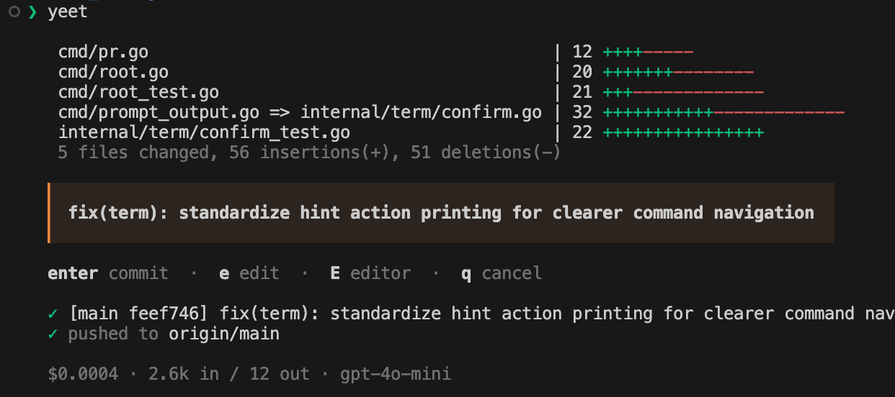

# yeet

Git commit & push in one command. With AI-generated commit messages.




Commit messages stream in token-by-token with a spinner. Diff stats, messages, and costs are color-coded. Set `NO_COLOR=1` to disable colors. Colors turn off automatically when stdout is not a terminal (piping); set `FORCE_COLOR=1` to keep them.

## Install

```sh
go install github.com/rasalas/yeet@latest
```

Or build from source:

```sh
git clone https://github.com/rasalas/yeet.git
cd yeet
go build -o yeet .
```

## Usage

```sh
yeet                     # AI generates the commit message
yeet fix typo in readme  # Use your own message
yeet -m "config"         # -m flag for words that collide with subcommands
yeet -l                  # Local commit only (skip push)
```

**What happens:**

1. Checks for staged changes — if none, runs `git add --all`
2. Shows diff stat (insertions in green, deletions in red)
3. Generates commit message (AI with streaming) or uses your message
4. You review — Enter to commit, `e` to edit inline, `E` to open `$EDITOR`, Esc to cancel
5. `git commit` + `git push` (or only commit with `-l`)

Selective staging works too:

```sh
git add src/auth.go
yeet                     # Only commits auth.go
```

Pressing Escape cancels safely — if yeet auto-staged, it unstages. If you staged manually, your staging is preserved.

## Commands

| Command | Description |
|---------|-------------|
| `yeet [message...]` | Stage, commit, push |
| `yeet -l [message...]` | Stage, commit locally (no push) |
| `yeet config` | Full-screen TUI for provider/model/keys |
| `yeet config edit` | Open `config.toml` in `$EDITOR` |
| `yeet auth` | Show API key status |
| `yeet auth set <provider>` | Store API key in OS keyring |
| `yeet auth delete <provider>` | Remove API key from keyring |
| `yeet auth import [provider]` | Import keys from env vars / OpenCode into keyring |
| `yeet auth reset` | Remove all API keys from keyring |
| `yeet doctor [--ai]` | Check config, auth, and optionally provider startup |
| `yeet prompt` | Edit the AI system prompt in `$EDITOR` |
| `yeet prompt show` | Print the current prompt |
| `yeet prompt reset` | Reset prompt to default |
| `yeet pr` | Create a GitHub/GitLab PR with AI-generated title and body |
| `yeet log <path>...` | AI work recap across repos (`--since`, `--until`, `--author`, `--export`) |
| `yeet eval plan` | Estimate eval sample + cost (no API calls) |
| `yeet eval generate` | Generate bounded A/B candidates from historical runs |
| `yeet eval judge` | Blind-judge A/B candidates (`A/B/tie/both bad`) |
| `yeet eval report` | Show win-rate, cost, latency, and phrase-hit stats |

## Setup

### 1. Pick a provider

```sh
yeet config
```

Opens a TUI where you can select your AI provider, set models, and manage keys.

**Builtin providers:**

| Provider | Default model |
|----------|---------------|
| Anthropic | `claude-haiku-4-5-20251001` |
| OpenAI | `gpt-4o-mini` |
| Ollama (local) | `llama3` |
| Pi | configured Pi provider/model |
| Codex CLI via ACP | native Codex config |
| Claude Code via ACP | native Claude config |

**Well-known providers** (OpenAI-compatible API):

| Provider | Default model |
|----------|---------------|
| Google | `gemini-3-flash-preview` |
| Groq | `llama-3.3-70b-versatile` |
| OpenRouter | `openrouter/auto` |
| Mistral | `mistral-small-latest` |

### 2. Set your API key

```sh
yeet auth set anthropic
```

Keys are stored in the OS keyring (macOS Keychain, Windows Credential Manager, Linux Secret Service). Environment variables (`ANTHROPIC_API_KEY`, `OPENAI_API_KEY`, etc.) are used as fallback.

Pi and the Codex/Claude ACP providers use their own CLI login/config and are not managed through `yeet auth`.

If you have keys in environment variables or OpenCode's `auth.json`, import them into the keyring:

```sh
yeet auth import           # Import all available keys
yeet auth import groq      # Import a specific provider
```

## Auto provider

The default provider is `auto`. It tries local/native providers first, then falls back to the cheapest available API-key provider by input token cost.

Default order:

1. `pi` with its configured upstream provider, if the `pi` command is available
2. `codex` via ACP, if the adapter command is available
3. `ollama`, if the configured Ollama server is reachable
4. `claude` via ACP, if the adapter command is available
5. API-key providers, sorted by input token cost

Native CLI subscription quota or remaining "volume" is not exposed to yeet, so it uses this fixed order instead of trying to guess it. Override it with:

```toml
[auto]
order = ["pi", "codex", "ollama", "claude", "api"]
```

Use `api` as a placeholder for all available API-key providers sorted by input-token cost. If you omit `api`, yeet will not fall back to API-key providers.

## Config

Config file: `~/.config/yeet/config.toml`

```toml
provider = "auto"

[anthropic]
model = "claude-haiku-4-5-20251001"

[openai]
model = "gpt-4o-mini"

[ollama]
model = "llama3"
url = "http://localhost:11434"
```

### Pi providers

Pi can route yeet requests through any provider available in the installed Pi client. This includes subscription-backed providers such as OpenAI Codex, Claude, GitHub Copilot, Gemini CLI, and Pi's configured API-key or custom providers.

Install Pi, start it once, and use `/login` to configure the providers you want. Then select `pi` in `yeet config`. Press `u` on the Pi entry to choose one of the providers advertised by Pi, `m` to choose one of that provider's models, and `t` to set the thinking level.

The default upstream is `openai-codex`. You can also configure it directly:

```toml
provider = "pi"

[custom.pi]
upstream = "anthropic"
model = "claude-sonnet-5"  # optional; omit to use Pi's native model
reasoning_effort = "low"
```

yeet runs Pi in JSON print mode with `--no-session`, disables tools and local context discovery, and streams only the generated message. These one-shot calls create neither Pi session files nor Codex app-server threads, so they do not appear as short script-like tasks in the Codex app.

Pi manages its own login in `~/.pi/agent/auth.json`; yeet does not copy or store those credentials. Direct yeet providers remain available for users who prefer yeet's keyring and plain HTTP calls. Run `pi` and use `/login` if `yeet doctor --ai` reports an authentication problem.

### Local ACP providers

`codex` and `claude` use local Agent Client Protocol adapters instead of yeet-managed API keys:

```toml
provider = "codex"  # or "claude"
```

The default adapters are launched with `npx`:

```toml
[custom.codex]
protocol = "acp"
model = "gpt-5.4-mini"  # optional; omit to use ~/.codex/config.toml
reasoning_effort = "low"  # optional; Codex defaults to lowest reasoning for yeet
command = "npx"
args = ["-y", "@agentclientprotocol/codex-acp@1.1.2"]

[custom.claude]
protocol = "acp"
model = "sonnet"  # optional; omit to use Claude's native config
command = "npx"
args = ["-y", "@agentclientprotocol/claude-agent-acp@0.32.0"]
```

These adapters use the agent's own auth, billing, and config (for example `~/.codex/config.toml` or `~/.claude/`). yeet does not store API keys for ACP providers. If `codex-acp` or `claude-agent-acp` is installed locally, yeet prefers the local binary over `npx`. To keep commit-message generation narrow, yeet sends the staged git context directly, advertises no client file-system or terminal capabilities, and automatically rejects ACP permission requests.

You can also set ACP models from `yeet config` with `m`. The picker reads the account-aware model choices advertised by the active Codex, Claude, or custom ACP adapter; bundled lists are only used as an offline/compatibility fallback. For Codex, `t` opens the thinking/reasoning picker (`low`, `medium`, `high`, `xhigh`). yeet defaults Codex reasoning to `low` so commit-message generation stays fast even if `~/.codex/config.toml` uses a higher global default. Current adapters receive the selected model and reasoning effort through ACP session options; legacy Codex adapters keep their `-c` overrides. Leaving the model unset uses the adapter's native config.

Use `yeet doctor --ai` for a no-generation provider smoke test. For ACP providers this only checks adapter startup, protocol initialization, and session creation; it does not ask the model to generate text.

You can add custom providers that use the OpenAI Chat Completions format:

```toml
[custom.together]
model = "meta-llama/Llama-3-70b-chat-hf"
url = "https://api.together.xyz/v1"
env = "TOGETHER_API_KEY"
```

## AI Context

When generating a commit message, yeet sends the following to the AI:

- **Diff** — `git diff --cached` (truncated at 8000 lines)
- **File status** — `git status --short` for a quick overview of all changes
- **Branch name** — used as hint for commit type and scope
- **Recent commits** — `git log --oneline -10` so the AI matches your style

## Custom Prompt

The system prompt lives at `~/.config/yeet/prompt.txt` and is created automatically on first run.

```sh
yeet prompt         # Edit in $EDITOR
yeet prompt show    # View current prompt
yeet prompt reset   # Restore default
```

## Eval (separate from commit flow)

`yeet eval` is an explicit, opt-in workflow for comparing prompt/model variants on real historical runs.

- Normal `yeet` commits stay fast — no extra model calls during commit.
- Run data is stored locally in SQLite: `~/.local/share/yeet/yeet.db`
- No upload/telemetry by default.
- Requires `sqlite3` to be available on `PATH` for eval commands/storage.
- More detail: [`docs/eval.md`](docs/eval.md)

Typical flow:

```sh
yeet eval plan --sample 20 --batch-size 5 --max-cost-usd 1.00
yeet eval generate --sample 20 --batch-size 5 --max-cost-usd 1.00 --prompt-file ./prompt-v2.txt
yeet eval judge --variant 3
yeet eval report --variant 3
```

Useful filters:

```sh
# Evaluate only runs where baseline output contains a phrase you want to remove
yeet eval generate --contains "for improved user" --sample 30 --batch-size 8

# Focus on runs where you had to edit the AI output
yeet eval generate --edited-only --sample 30 --batch-size 8
```
